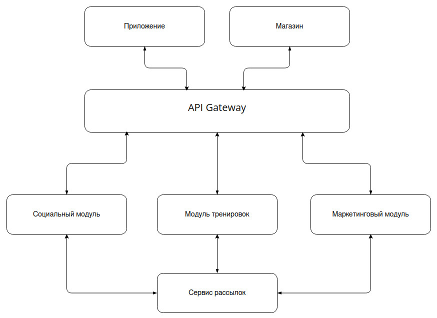

[Оглавление](README.md)
# Архитектура

Концептуальная архитектура системы будет состоять из следующих компонентов:

| Модуль | Назначение |
| ------ | ---------- |
| API Gateway | Единая точка входа в приложение, осуществляющая функции аутентификации, авторизации и роутинга запросов |
| Приложение для смартфона | Модуль, реализующий интерфейс приложения в смартфона |
| Магазин | Продажа товаров |
| Тренировки | Отслеживание и запись тренировок, виртуальный ассистент |
| Социальный | Все составляющие социальной сети (группы, сообщения, лента и т.д.), а также достижения |
| Маркетинговый | Маркетинговые материалы, персональные предложения и интеграция с магазином |

Схема концептуальной архитектуры представлена на рисунке ниже:

Главной точкой входа в приложение будет API Gateway, которая будет принимать первичный запрос от пользователя. Здесь
происходит аутентификация и авторизация пользователя.
Модуль тренировок, социальный и маркетинговый тесно взаимодействуют друг с другом через API Gateway для обмена 
информацией о тренировках, генерации ленты активности, персональный предложений и т.д.
Взаимодействие между компонентами внутри модулей будет происходить напрямую, без вовлечения API Gateway