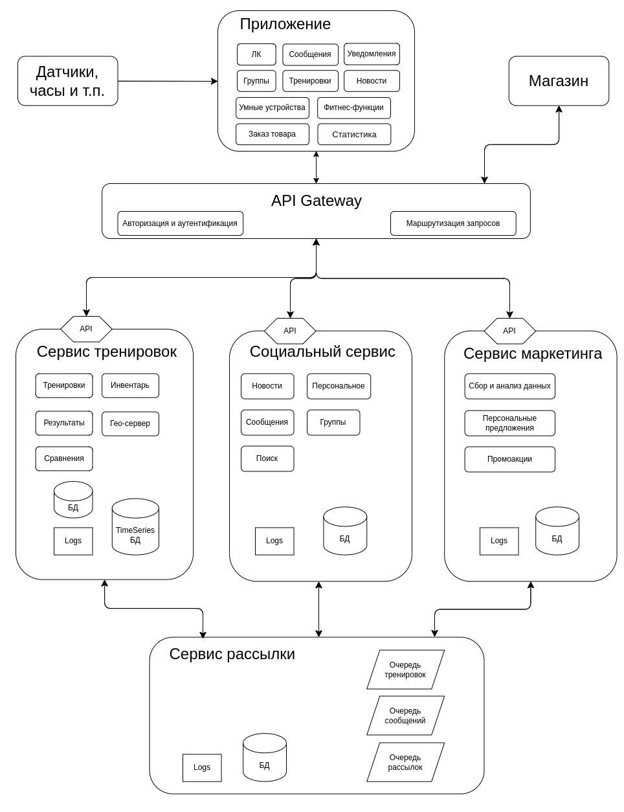

[Оглавление](README.md)
# Базовая архитектура

API Gateway - основная точка входа в системные модули. 
Данный компонент отвечает роутинг первоначальных запросов, а также за функции аутентификации 
и авторизации.

### **Модуль тренировок**

Запись тренировки осуществляется через установленное приложение на смартфоне. Данные о 
тренировочном процессе собираются подключенными портативными устройствами (телефон, часы, 
датчики сердцебиения, кислородный, шагомеры, браслеты и т.д.) и передаются в наше приложение. 
После окончания записи тренировки приложение при наличии интернета (иначе - сохраняет локально для 
дальнейшей передачи) передает запись на сервер, который кладет её в специальную очередь. 
Модуль тренировок забирает запись из очереди и записывает в БД временных рядов. 
После записи процессинговый модуль сервера проводит её обработку (расчёты различных 
показателей, сравнения, наложение координат на гео-сервер и т.п).

### **Социальный модуль**

Пользователь через приложение обращается к API, запрос уходит модуль. Если запрос подразумевает 
использование каких-то данных из сторонних модулей (тренировок или маркетинга) - модуль через 
API делает запрос к API другого модуля. Полученные данные кэшируются.

### **Модуль маркетинга**

Модуль маркетинга запрашивает через API данные из других модулей, загружает их в свою базу 
для анализа, и с помощью механизмов машинного обучения формирует таргетированные 
индивидуальные предложения для пользователей.

### **Магазин**

Взаимодействия с ним осуществляется через API. Результаты запросов кэшируются.

### **Уведомления**

Push-up уведомления на приложения будут приходить с помощью Web-socket, или другого похожего 
механизма. Рассылки писем будут осуществляться с помощью специальной утилиты, а также очереди.
Модуль генерирует необходимое письмо и складывает ее в очередь на отправку. Утилита рассылки 
обрабатывает очередь по мере возможности.