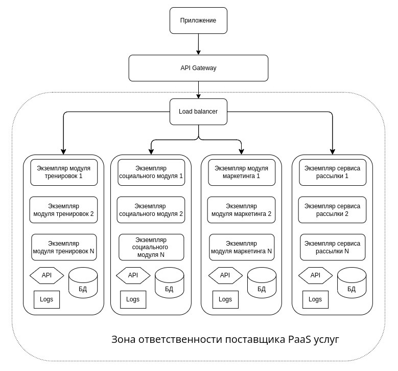

[Оглавление](README.md)
# Основные представления

### Основные представления

#### Функциональное

Основные функции системы, которые реализуются в рамках разных модулей представлены ниже:

Главным интерфейсом доступа к функциям системы является приложение. Оно обеспечивает следующие
функции:

- Запись и загрузку тренировок
- Просмотр статистики тренировок
- Интерфейс социальной сети
- Просмотр и редактирование профиля пользователя
- Интерфейс доступа к магазину и управлению покупками

**API Gateway обеспечивает следующие функции**

- Аутентификация
- Авторизация
- Управление распределением и маршрутизацией запросов

**Модуль тренировок обеспечивает следующие функции**

- Запись и хранение пользовательских тренировок
- Обработка пользовательских тренировок (разные статистические срезы, сравнение с другими 
  пользователя и т.д.)
- Генерация уведомлений со стороны своего модуля

**Модуль маркетинга обеспечивает следующие функции:**

- Получение из других модулей, нормализация и хранение данных для машинного обучения
- Анализ пользовательских данных (выявление трендов, предпочтений и т.д.)
- Генерация персональный таргетированных предложений

**Социальный модуль обеспечивает следующие функции**

- Предоставляет API для фронтэнда и приложения
- Хранит данные пользователя, данные для работы социальной сети, а также планы тренировок
- Генерирует персональную ленту пользователя
- Генерирует предложения по тренировкам (предлагает пользователей для совместных тренировок, 
  участие в разных спортивных мероприятиях и т.д.)

**Сервис рассылок**

- Предоставляет функционал рассылок другим модулям

#### Информационное представление

#### Многозадачность

- Для операций, которые могут затрагивать обработку или передачу больших объемов данных будут 
  созданы очереди сообщений. Сообщения будут складываться в очереди и обрабатываться по мере 
  возможности, что минимизирует риск потери данных и возникновения коллизий
- При необходимости будут автоматически подниматься новые экземпляры модулей, для ускорения 
  обработки пользовательских запросов
- Само наше приложение не участвует в таких важных операциях как цепочка покупки товара 
  (с резервированием на складе и списанием денег). Весь этот функционал нам предоставляет 
  магазин через свой API. В связи с этим у нас нет необходимости в хранении сложных 
  пользовательских состояний.

#### Инфраструктурное

В виду сложности реализации и поддержки, а также в связи с введенными санкциями - построение 
своей собственной инфрастуктуры под проект не является целесообразным.
Предполагается найти облачного поставщика PaaS решения и отдать ему всю ответственность по 
обслуживанию и управлению инфраструктурными решениями, такими как:
- обслуживание БД
- резервное копирование
- балансировка нагрузки
- обнаружение сервисов
- управление экземплярами приложений
- обслуживание и обновление операционных систем
- базовая конфигурация безопасности инфрастуктуры

Инфраструктуру можно организовать на базе оркестрируемой контейнеризации. Модули приложения 
упаковывать в контейнеры и поды. Это позволит быстро разворачивать новые экземпляры требуемых 
модулей при необходимости.

#### Безопасность

Обеспечение безопасности будет основываться на следующих моментах:

- В виду концепции взаимодействия между сервисами через REST API, которое реализуется через 
  HTTP протокол - необходимо зашифровать весь передаваемый траффик - т.е. реализовать 
  всё взаимодействие между API сервисов по протоколу HTTPS.
- Всё общение между сервисами и компонентами внутри сервисов происходит с использованием 
  JWT-токенов.
- Все чувствительные данные хранятся только зашифрованном виде.
- Доступ к внутренним API сервисов из сети интернет будет запрещен.
- Политики в области паролей
- Чёткая ролевая модель доступа к ресурсам
- Настройка сетевого мониторинга для выявления попыток атак или попыток доступа к закрытым 
  ресурсам
- Невозможность доступа к какому-либо ресурсу, кроме лендинг-страниц и страниц регистрации 
  без JWT-токена
- Доступ к базам данных только с адресов и ролей сервиса, который эту БД использует

